 [Github](https://github.com/armatita)
 [Stack Overflow](https://stackoverflow.com/users/2868335/armatita?tab=profile)
 [Research Gate](https://www.researchgate.net/profile/Pedro_Correia2)
 [Linkedin](https://www.linkedin.com/in/pedropintocorreia/)
 [Behance](https://www.behance.net/pedrocorre8962/)
 [Soundcloud](https://soundcloud.com/pedro-correia-712367707)
 | [ORCID](https://orcid.org/0000-0002-0399-4982)

Finished [MSc](https://fenix.tecnico.ulisboa.pt/cursos/megm/descricao) degree at [IST](https://tecnico.ulisboa.pt/en/) 
in [2009](https://fenix.tecnico.ulisboa.pt/downloadFile/395139480478/NaturalFractureNetworks.pdf) and immediately after 
(2010) joined [Cerena](http://cerena.ist.utl.pt/) research center. There conducted research and development in several 
fields of mathematics applied to geosciences and released open-source software such as [Fillworks](https://sourceforge.net/projects/fillworks/),
[ECMWF parser](https://sourceforge.net/projects/ecmwfparser/) and [GEOMS2](https://sourceforge.net/projects/geoms2/?source=directory).
In 2014 became Assistant Lecturer for two MSc level courses at [IST](https://tecnico.ulisboa.pt/en/) and by 2016 joined [Geovariances](http://www.geovariances.com/en/) 
as Software Engineer. During the course of almost 4 years, has developed [UncerTZ/Isatis.neo Petroleum](https://www.geovariances.com/en/news/uncertz-consortium-time-depth-conversion-evolved/), as well as designed its brand and visual communication. More recently, in 2019, joined [Eyeware](https://eyeware.tech/) as UI\UX Consultant for which it builds end user products related to gaze tracking using volumetric video. Independently it has developed several free [Educational Apps](https://play.google.com/store/apps/dev?id=6135518111922353974&hl=en) 
for Android and frequently releases online publications and software.

# Index 

* [Software](#Software)
  * [Commercial Software](#Commercial-Software)
  * [Open-Source Software](#Open-Source-Software)
  * [Educational Apps](#Educational-Apps)
* [Work Experience](#Work-Experience)
  * [Scientific Software Engineer](#Scientific-Software-Engineer-RetinAI) 
  * [Consultant (UI\Software Engineering)](#Consultant-UI-Eyeware)
  * [Software Engineer](#Software-Engineer-Geovariances)
  * [Co-Founder](#Co-Founder-anteia)
  * [University Assistant Lecturer](#Assistant-Lecturer-IST)
  * [Researcher](#Researcher-Cerena)
* [Technical Literature](#Technical-Literature)
  * [Scientific Publications, eBooks, and Video Tutorials](#Scientific-Publications-eBooks-and-Video-Tutorials)
  * [White Papers](#White-Papers)
  * [Peer-Reviewed Articles, Conference Papers and Posters](#Peer-Reviewed-Articles-Conference-Papers-and-Posters)
* [Graphic Design](#Graphic-Design)
  * [Branding and Logos](#Branding-and-Logos)
  * [Icons](#Icons)
  * [Marketing](#Marketing)
  * [Scientific Illustration](#Scientific-Illustration)
  * [Game Art and Animation](#Game-Art-and-Animation)
* [User Experience](#User-Experience)
  * [Widgets](#Widgets)
* [Video Production](#Video-Production)
* [Musical composition and Songwriting](#Musical-composition-and-Songwriting)

# Software 

I've produced desktop software in several scientific fields, both commercial and open-source. Further I've developed several educational apps for Android (free models in mobile equipments). 

## Commercial Software 

* [AMD Privacy View](https://www.amd.com/en/technologies/radeon-privacy-view) - Was part of the development team for AMD Privacy View, including UI/UX, backend, and feature development. AMD Privacy View is a desktop application made to safeguard your screen by blurring everything except the part you are looking at (among other features).

* [Beam](https://beam.eyeware.tech/) - Developed multiple iterations for the desktop application Beam (there's an iOS counterpart also). Beam is a gaze tracker app to be used by gamers (augmented gamming using the head pose), streamers, among other content creators.

* [GazeSense](https://eyeware.tech/gazesense/) - Performed functions on the level of architecture, core technology, UX\UI, and graphical design. GazeSense is a software specialized in unassisted gaze tracking.

* [Isatis.neo](https://www.geovariances.com/en/software-geovariances/) - It developed tools for this and other software solutions in Geovariances. Isatis.neo and other Geovariances products use geostatistics to perform spatial estimation in several sectors related to spatial imaging, namely Oil & Gas, Mining, Environment, Hydrogeology, Contamination, etc.

* [UncerTZ/Isatis.neo Petroleum](https://www.geovariances.com/en/news/uncertz-consortium-time-depth-conversion-evolved/) - As part of a research and development consortium a time to depth conversion software was developed, later added as the Oil & Gas oriented edition of Isatis.neo. This software uses geostatistics, among other techniques, to perform a series of operations regarding the fields of Geophysics and Reservoir Engineering. 

[Back to top](#Index)

## Open-Source Software

* [GEOMS2](https://sourceforge.net/projects/geoms2/) - A Geostatistics and Geosciences modeling software. Mostly written 
in [Python](https://www.python.org/) (some algorithms in C/C++), its fully equipped with a 3D viewer ([Mayavi](http://docs.enthought.com/mayavi/mayavi/)), 
2D plots ([matplotlib](https://matplotlib.org/)) and several numerical features for estimation, simulation, data analysis,
and modeling. It was developed to replace software like the historical [Geoms](https://sourceforge.net/projects/geoms/) and
[GSI Student Toolbox](https://sourceforge.net/projects/gsistb/) (only the latter developed by me). This project was made 
within [Cerena](http://cerena.ist.utl.pt/) research center as support to research and education. 

* [ECMWF parser](https://sourceforge.net/projects/ecmwfparser/) - This software was developed to support the research and 
development conducted by [Cerena](http://cerena.ist.utl.pt/) research center in the [ESA](http://www.esa.int/ESA) project 
[Desertwatch](http://due.esrin.esa.int/page_project65.php). This project aimed to develop of an EO-based Information 
System to support national and regional authorities in reporting to the UNCCD and monitoring 
desertification trends over time. The software itself computed, visualized, and estimated (downscaling operations) 
important risk factors maps from the [ECMWF](https://www.ecmwf.int/) reanalysis data. Other smaller toolbox were built 
within the same project such as [ANA parser](https://sites.google.com/site/cmrpsoftware/anaparser).

* [Fillworks](https://sourceforge.net/projects/fillworks/) - Fillworks was developed to support a consultancy project 
regarding the construction of a railway line in New Guinea. It provides visualization, drawing and calculation of 
fill and cut areas (to extrapolated volumes) given topography. This quantification of different railway scenarios 
provided a first measure of cost prior to further developments in construction. Latter it was used for 
 educational purposes.
 
* [dAnalytics](https://sourceforge.net/projects/danalytics/) - Small tool built specifically for educational purposes 
in data analysis, specifically discriminant analysis, allowing the student to quickly make experiments in 
a GUI supported environment.

[Back to top](#Index)

## Educational Apps

* [The Math Adventures of Oscar](https://play.google.com/store/apps/details?id=com.anteia.tmaoo&hl=en) - basic math casual game with several modes with the purpose of providing exercises in different operations. (given some changes in google policies this game requires some updates prior to be put in the store. I'm currently in the process of doing so.)
* [The Algebra Adventures of Oscar](https://play.google.com/store/apps/details?id=com.anteia.taaoo&hl=en) - a game with exercises a bit more complex than the previous showing directly mathematical formula for progression in algebra skills.
* [The Number Adventures of Oscar](https://play.google.com/store/apps/details?id=com.anteia.tnaoo&hl=en) - a visual approach to mathematical operations like multiplication and division.
* [The Puzzle Adventures of Oscar](https://play.google.com/store/apps/details?id=com.anteia.tpaoo&hl=en) - a casual puzzle game played by dragging pieces to the correct position.
* [The Time Adventures of Oscar](https://play.google.com/store/apps/details?id=com.anteia.ttaoo&hl=en) - a game with exercises on learning how to check the time.

[Back to top](#Index)

# Work Experience

I've worked in a research center (in geosciences), as university assistant lecturer, as a software engineer in a company which develops software for scientific purposes, and UX Consultant in software for gaze tracking. I've also, at some point, started my own endeavour (with a friend) in building a company to produce digital products for education.

## Scientific Software Engineer (Retinai, Switzerland)

Based in Lisbon. Started working for [RetinAI](https://www.retinai.com/) in July, 2022. I support research team within RetinAI with actions related with data processing, preparation, and analysis. I've also provided maintenance and development for clinical studies, such as [Razorbill](https://www.retinai.com/case-study/razorbill-study), [Better](https://www.retinai.com/case-study/better-study), or [CARDS](https://www.retinai.com/case-study/cards-study).

## Consultant (UI\Software Engineering) (Eyeware, Switzerland)

Based in Lisbon. Started working for [Eyeware](https://eyeware.tech/) in September, 2019. It is part of my functions to further develop Eyeware products, namely the UI\UX for [GazeSense](https://eyeware.tech/gazesense/). On the course of my stay at Eyeware I've:

* Designed a workflow to perform gaze tracking in the Retail sector.
* Designed the 3d visualization engine (OpenGL bases) powering GazeSense scene builder and viewer.
* Contributed to the development of the core gaze tracking technology.
* Refactored Eyeware products using solid programming and UX patterns.
* Built and designed a new product line for desktop based gaze tracking.
* Development work for the applications GazeSense, Beam, and AMD Privacy View, among others.

## Software Engineer (Geovariances, France)

Worked in Geovariances, 2016-2019, within a R&D team to develop a new time to depth conversion software within a consortium named [UncerTZ](https://www.geovariances.com/en/news/uncertz-consortium-time-depth-conversion-evolved/). The software has been successfully completed and set to be released early 2019 ([Isatis.neo - Petroleum edition](https://www.geovariances.com/en/conversion-and-uncertainties-workflow/)). This package will appear inside Isatis.neo, geostatics modeling software, to be released at the same time.

Besides the completion of the main target some other of my achievements in Geovariances include:

* General purpose development for Isatis.neo software.
* Design of the splashscreen for Isatis.neo software.
* Design of the logo for Isatis.neo software. (See: [Branding and Logos](#Branding-and-Logos))
* Update of an older logo of a Geovariances software to a flat style. (See: [Branding and Logos](#Branding-and-Logos))
* Co-writer of paper [A Case Study Of A New Time-Depth Conversion Workflow Designed For Optimizing Recovery](http://www.earthdoc.org/publication/publicationdetails/?publication=93943) submited for ECMOR XVI - 16th European Conference on the Mathematics of Oil Recovery. (see: [Peer-Reviewed Articles, Conference Papers and Posters](#Peer-Reviewed-Articles-Conference-Papers-and-Posters))
* Designer of the poster [A Case Study Of A New Time-Depth Conversion Workflow Designed For Optimizing Recovery](http://www.earthdoc.org/publication/publicationdetails/?publication=93943) presented at ECMOR XVI - 16th European Conference on the Mathematics of Oil Recovery. (See: [Scientific Illustration](#Scientific-Illustration))
* Co-writer of the paper [Proper Systemic Knowledge of Reservoir Volume Uncertainties in Depth Conversion](http://www.cspg.org/cspg/documents/Conference%20Website/Gussow/Archives/2018/Extended/Poster/D.Garner.pdf) submited for Closing the Gap III - Advances in Applied Geomodeling for Hydrocarbon Reservoirs. (see: [Peer-Reviewed Articles, Conference Papers and Posters](#Peer-Reviewed-Articles-Conference-Papers-and-Posters))
* Designer of the poster [Proper Systemic Knowledge of Reservoir Volume Uncertainties in Depth Conversion](http://www.cspg.org/cspg/documents/Conference%20Website/Gussow/Archives/2018/Extended/Poster/D.Garner.pdf) presented at Closing the Gap III - Advances in Applied Geomodeling for Hydrocarbon Reservoirs. (See: [Scientific Illustration](#Scientific-Illustration))
* Prototyping/Developer of new widgets in [Qt](https://www.qt.io/) for depth conversion workflow software (See: [Widgets](#Widgets)).
* Design of several icons in Geovariances software. (See: [Graphic Design](#Graphic-Design))
* Design of marketing material. (See: [Marketing](#Marketing))
* Technical reporting and documentation.
* Client presentation.
* Conference presentation (Poster Session).
* Co-writer of the paper [Integration of Fault Location Uncertainty in Time to Depth Conversion](https://eage.eventsair.com/81st-eage-annual-conference-and-exhibtion/) to be published in June 2019 in the [EAGE Conference 2019 - London](https://eage.eventsair.com/81st-eage-annual-conference-and-exhibtion/).
* Co-writer of the paper [Emergence of edge scenarios in uncertainty studies for reservoir trap analysis](https://seg.org/Annual-Meeting-2019) to be published in September 2019 in the [SEG Annual Meeting - San Antonio](https://seg.org/Annual-Meeting-2019).
* Writer of technical opinion article "Walking the Rim of Depth Conversion Technology" in EAGE Daily News ([EAGE Conference 2019 - London](https://eage.eventsair.com/81st-eage-annual-conference-and-exhibtion/)).
* Writer of technical opinion article "Uncertainty in Depth Conversion: Why should I care?" in EAGE Daily News ([EAGE Conference 2019 - London](https://eage.eventsair.com/81st-eage-annual-conference-and-exhibtion/)).
* Production of the [promo video for Isatis.neo](https://www.youtube.com/watch?v=ge-dMqsSFmo) software. (See: [Video Production](#Video-Production))

[Back to top](#Index)

## Co-Founder (anteia)

In 2014 and 2015 me a friend started a project company named "anteia" with the objective of building software for scientific and educational purposes. A bit more than year on the going we had to halt the project due to lack of funding. However, in the meanwhile several different educational products and demos were released and presented to potential clients.

* The Math Adventures of Oscar - an android game to teach basic math. (See: [Educational Apps](#Educational-Apps))
* The Algebra Adventures of Oscar - a more advanced version of the previous game presenting formula directly. (See: [Educational Apps](#Educational-Apps))
* The Number Adventures of Oscar - a visually guided teaching tool for division and multiplication. (See: [Educational Apps](#Educational-Apps))
* The Puzzle Adventures of OScar - a puzzle solving game. (See: [Educational Apps](#Educational-Apps))
* The Time Adventures of Oscar - a game that would teach players on how to tell the time (from an anologic model clock). (See: [Educational Apps](#Educational-Apps))
* Saude e Educação (Health and Education; Demo) - an interactive manual for teaching important concepts biology for healthcare (anatomy). (See: [Game Art and Animation](#Game-Art-and-Animation))
* Aprender Português (Learning Portuguese; Demo) - an interactive experience into teaching portuguese to foreign students. (See: [Game Art and Animation](#Game-Art-and-Animation))
* WALF - a very visual point and click crime game. A interactive novelization of a script written for the purpose. (See: [Game Art and Animation](#Game-Art-and-Animation) and [Musical Composition and Songwriting](#Musical-composition-and-Songwriting))

[Back to top](#Index)

## Assistant Lecturer (IST)

My employer was [IST](https://tecnico.ulisboa.pt/en/), an engineering University in Lisbon. This happened in the years of 2014 and 2015.

* [Geostatistics](https://fenix.tecnico.ulisboa.pt/disciplinas/G4517957/2018-2019/1-semestre) - For both Mining and Geology Engineering and Petroleum Engineering at Msc level, [IST](https://tecnico.ulisboa.pt/en/) University (2014/2015). 
* [Stochastic Modeling of Oil Reservoirs](https://fenix.tecnico.ulisboa.pt/disciplinas/MRP3645111326/2017-2018/2-semestre/pagina-inicial) - For Petroleum Engineering at Msc level, [IST](https://tecnico.ulisboa.pt/en/) University (2014/2015). 

To have an idea of the program of these courses you can check the powerpoint presentation I used in classes. It's available for [donwload in Research Gate](https://www.researchgate.net/publication/268811925_Student_Garden_Geostatistics_course).

[Back to top](#Index)

## Researcher (Cerena)

My employer was research center [Cerena](https://cerena.ist.utl.pt/), part of [IST](https://tecnico.ulisboa.pt/en/) University.

* 2010 - Initiated research for new seismic inversion methodology named "Direct Inversion of Porosity". 
* 2010 - Developed octave version of Fillworks software (cut and fill studies). 
* 2010 - Developed python standalone version of [Fillworks software](http://sourceforge.net/projects/fillworks/). 
* 2011 - Finished research for "Direct Inversion of Porosity" project and developed the algorithm implementation of the same method. 
* 2011 - Developed [ECMWF parser](http://sourceforge.net/projects/ecmwfparser/) software for environmental studies using re-analysis ECMWF data.
* 2012 - Developed [GSI student toolbox](http://sourceforge.net/projects/gsistb/?source=directory) software for seismic inversion and oil reservoir characterization. 
* 2012 - Research on the Global Stochastic Inversion method and development of a new software implementation of the same method for hypothesis testing.
* 2013 - Development of JimFusion software for image processing and GIS analysis (does not have public release). 
* 2013 - Research and development of the methodology and algorithm for Block Indicator Simulation. 
* 2013 - Characterization of an ore mine in Portugal using Block Indicator Simulation (see: [Uncertainty Assessment of the Orebodies Geometry Using Block Indicator Simulation](https://link.springer.com/chapter/10.1007/978-3-642-32408-6_158)).
* 2013 - Developed algorithm and software for soil contamination assessment (see: [Geostatistical Data Integration Model for Contamination Assessment](https://link.springer.com/article/10.1007/s11004-013-9466-1)). 
* 2013 - Development of [dAnalytics](http://sourceforge.net/projects/danalytics/) software for class support in discriminant analysis teaching. 
* 2013 - Has begun development of geoscience modeling software [GEOMS2](http://sourceforge.net/projects/geoms2/). 
* 2014 - Has finished development of geosciences modeling software [GEOMS2](http://sourceforge.net/projects/geoms2/).
* 2014 - Has done research in elastic seismic inversion (see: [Multidimensional scaling for the evaluation of a geostatistical seismic elastic inversion methodology](http://library.seg.org/doi/abs/10.1190/geo2013-0037.1)). 
* 2015 - Has done research and development in gradient pore pressure modeling, specifically data analysis and visualization (see: [Gradient Pore Pressure Modelling with Uncertain Well Data](http://www.earthdoc.org/publication/publicationdetails/?publication=82232)). 

[Back to top](#Index)

# Technical Literature

I've made publications to support education at university level, as well as several articles written for international journals and conferences.

## Scientific Publications, eBooks, and Video Tutorials

* [Modelação e Estimação – Uma introdução à Geoestatística (2010)](http://www.leg.ufpr.br/lib/exe/fetch.php/disciplinas:geoesalq:pira2012:numist_-_modelacao_e_estimacao_-sgems.pdf) (en: *Modeling and Estimation - An introduction to Geostatistics*) - This was a publication made to support Geostatics students at IST. It was originally released as a free e-book to [numist](http://numist.tecnico.ulisboa.pt/~numist.daemon/) student association which me and a group of colleagues had just founded. However I'm linking some other repository because the original seems to be down.
* [Introdução à programação Parte I -Octave (2010)](https://www.researchgate.net/publication/268811857_Introducao_a_programacao_Parte_I_-Octave) (en: *Introducation to Programming: Octave*)- A publication made to explain programming concepts and data analysis using programming language [Octave](https://www.gnu.org/software/octave/). It's written in Portuguese.
* [Introdução à programação Parte II -Python (2011)](https://www.researchgate.net/publication/268811866_Introducao_a_programacao_Parte_II_-Python) (en: *Introduction to Programming: Python (2011)*)- A publication made to explain programming concepts, data analysis, UI development, and scientific visualization using programming language [Python](https://www.python.org/) plus a number of external libraries (numpy, scipy, matplotlib, wxwidgets, etc.).  It's written in Portuguese.
* [Introdução à programação – Parte 3 - SAGE (2011)](https://www.researchgate.net/publication/268811870_Introducao_a_programacao_-_Parte_3_-_SAGE) (en: *Introduction to Programming: Sage*) - A publication made to explain programming concepts and data analysis using programming language [Sage](http://www.sagemath.org/). It's written in Portuguese.
* [Introduction to Python](https://www.youtube.com/watch?v=vEvSEcbOsVY) - This is a series of video tutorials about the basics of Python Programming. Originially these were part of a ShowMeDo kind of project for which I colaborated with. When that repository went offline another youtube user upload the videos which I'm linking (with my consent). Spoken in Portuguese.
* [Introduction to Python and Matplotlib](https://www.youtube.com/watch?v=vEvSEcbOsVY) - This is a series of video tutorials about Python Programming, specifically using visualization library matplotlib. Originially these were part of a ShowMeDo kind of project for which I colaborated with. When that repository went offline another youtube user upload the videos which I'm linking (with my consent). Spoken in Portuguese.
* [Introduction to Python and wxWidgets](https://www.youtube.com/watch?v=vEvSEcbOsVY) - This is a series of video tutorials about Python Programming, specifically using user interface library wxWidgets. Originially these were part of a ShowMeDo kind of project for which I colaborated with. When that repository went offline another youtube user upload the videos which I'm linking (with my consent). Spoken in Portuguese.

[Back to top](#Index)

## White Papers

* [Learning Game: The Math Adventures of Oscar](https://www.researchgate.net/publication/277776242_Learning_Game_The_Math_Adventures_of_Oscar) (2015) - The game was developed to train memory and mathematical reasoning of children in the ages of 5 to 9 and was largely adapted from the concept of casual gaming, typically a kind of game with a small amount of required commitment where the game-play is extremely intuitive and it has a “just to pass the time” state of mind. This article documents the development and the chosen method of commercialization for this game.
* [An introduction to "collective publishing"](https://www.researchgate.net/publication/262796853_An_introduction_to_collective_publishing) (2014) - Considering the current state of communication technology this article hopes to expose a new concept, henceforth called “collective publishing”, which allows users to create their own journals and magazines without the need for sophisticated and highly proficient teams and software.
* [Natural Fracture Networks](https://fenix.tecnico.ulisboa.pt/downloadFile/395139480478/NaturalFractureNetworks.pdf) (2009) - This is actually the extended abstract version of my thesis. It was reviewed by juri but it was never published in journal.

[Back to top](#Index)

## Peer-Reviewed Articles, Conference Papers and Posters

* P. Correia, J. Chautru, Y. Meric, F. Geffroy, H. Binet, P. Ruffo and L. Bazzana, [Automatic Scenarios Extraction from Depth Uncertainty Evaluation](https://www.earthdoc.org/content/papers/10.3997/2214-4609.201902184), Petroleum Geostatistics 2019, Sep 2019, Volume 2019, p.1 - 5, https://doi.org/10.3997/2214-4609.201902184

* Pedro Correia, Yves-Marie Meric, François Geffroy, Hélène Binet, Jean-Marc Chautru, and Nicolas Nosjean-Gorgeu, [Emergence of edge scenarios in uncertainty studies for reservoir trap analysis](https://library.seg.org/doi/10.1190/segam2019-3214431.1), SEG Technical Program Expanded Abstracts 2019, https://doi.org/10.1190/segam2019-3214431.1

* F. Geffroy, P. Correia, H. Binet, J. Chautru, D. Renard and N. Nosjea-Gorgeu, [Integration of Fault Location Uncertainty in Time to Depth Conversion](https://www.earthdoc.org/content/papers/10.3997/2214-4609.201900743), 81st EAGE Conference and Exhibition 2019, Jun 2019, Volume 2019, p.1 - 5, https://doi.org/10.3997/2214-4609.201900743

* Pedro Correia, François Geffroy, Hélène Binet, Jean-Marc Chautru, Didier Renard, A. Yewgat, Frédéric Huguet, and Catherine Formento, [Correction of mis-ties in seismic data using a variation of kriging with variance of measurement error](https://library.seg.org/doi/10.1190/segam2019-3216264.1), SEG Technical Program Expanded Abstracts 2019, https://doi.org/10.1190/segam2019-3216264.1

* H. Binet, P. Correia, N. Nosjean-Gorgeu, D. Renard, F. Geffroy, J.M. Chautru, D. Garner, [Proper Systemic Knowledge of Reservoir Volume Uncertainties in Depth Conversion](http://www.cspg.org/cspg/documents/Conference%20Website/Gussow/Archives/2018/Extended/Poster/D.Garner.pdf), Closing the Gap III - Advances in Applied Geomodeling for Hydrocarbon Reservoirs, October 8-11, Lake Louise, Alberta - Canada (2018)

* J.M. Chautru, N. Nosjean-Gorgeu, D. Renard, H. Binet and P. Correia; [A Case Study Of A New Time-Depth Conversion Workflow Designed For Optimizing Recovery](http://www.earthdoc.org/publication/publicationdetails/?publication=93943), ECMOR XVI - 16th European Conference on the Mathematics of Oil Recovery - ECMOR XVI Poster Session 2, 3 September 2018, DOI: 10.3997/2214-4609.201802197 (2018)

* Nunes R., Correia P., Soares A., Costa J.F.C.L, L.E.S. Varella, Neto G.S., Silka M.B., Barreto B.V., Ramos T.C.F., Domingues M.; 
[Gradient Pore Pressure Modelling with Uncertain Well Data](http://www.earthdoc.org/publication/publicationdetails/?publication=82232), 
[EAGE](https://www.eage.org/) – Petroleum Geostatistics 2015, 7 – September-2015, DOI: 10.3997/2214-4609.201413637 (2015)

* Azevedo L., Nunes R., Correia P., Soares A., Guerreiro L., Neto G.; 
[Multidimensional scaling for the evaluation of a geostatistical seismic elastic inversion methodology](http://library.seg.org/doi/abs/10.1190/geo2013-0037.1), 
[Geophysics](http://library.seg.org/journal/gpysa7) , 01/2014, volume 79, issue 1, pp. M1-M10, DOI: 10.1190/geo2013-0037.1 
(2014)

* Horta A., Correia P., Pinheiro L., Soares A.; 
[Geostatistical Data Integration Model for Contamination Assessment](https://link.springer.com/article/10.1007/s11004-013-9466-1), 
[Mathematical geosciences](https://link.springer.com/journal/11004), 01/2013; DOI: 10.1007/s11004-013-94661 (2013)

* Carvalho J., Correia P., Menezes S., Peixoto C., Soares A.; 
[Uncertainty Assessment of the Orebodies Geometry Using Block Indicator Simulation](https://link.springer.com/chapter/10.1007/978-3-642-32408-6_158), 
[Proccedings of the 15th Annual Conference of the International Association for Mathematical Geosciences](https://link.springer.com/book/10.1007/978-3-642-32408-6), 
Part XXI, Mineral and Energy Resources for Planet Earth: Evaluations, Extraction and Optimal Management, 
p.731, DOI: 10.1007/978-3-64232408-6_158 (2013)

* Azevedo L., Correia P., Nunes R., Soares A.; 
[Geostatiscal AVO Direct Facies Inversion](https://link.springer.com/chapter/10.1007/978-3-642-32408-6_124), 
[Proccedings of the 15th Annual Conference of the International Association for Mathematical Geosciences](https://link.springer.com/book/10.1007/978-3-642-32408-6), 
Part XVII - Modeling of Energy Resources, p.565, DOI: 10.1007/978-3642-324086_124 (2013)

* Azevedo L., Nunes R., Correia P., Soares A., Guerreiro L.; 
[Stochastic direct facies seismic AVO inversion](http://library.seg.org/doi/abs/10.1190/segam2013-0555.1), 
[SEG Technical Program Expanded Abstracts](http://library.seg.org/doi/book/10.1190/segeab.32), 
01/2013, DOI: 10.1190/segam2013-0555.1 (2013)

* Azevedo L., Nunes R., Correia P.,  José A. Almeida, Luís M. Pinheiro, Maria H. Caeiro, and Amílcar Soares; 
[Seismic Attributes for Constraining Geostatistical Seismic Inversion](http://geostats2012.nr.no/pdfs/1747979.pdf), 
[Ninth International Geostatistics Congress](http://geostats2012.nr.no/) 01/2012; (2012)

[Back to top](#Index)

# Graphic Design

I've used mostly vector graphics for a number of tasks related to branding, marketing, aesthetics, user experience, and art. You can check my [Behance profile](https://www.behance.net/pedrocorre8962/) for a better experience in analyzing graphical material (only some of the projects are present in Behance).

## Branding and Logos

<small>From left to right the logos of GEOMS2 (2013), anteia (2015), UncerTZ consortium (2016), Kartotrak (2018; "flat" style modification of a logo **not originally designed by me**), Isatis.neo (2018; release 2019). The order is cronological. All of the projects were made with vectorial graphics. My software of choice to do so is [Inkscape](https://inkscape.org/).</small>

[Back to top](#Index)

## Icons

I've made a number of icons in the past for multiple projects. These are general purpose examples:

And some other examples made in isometric style:

More recently I've prepared the icon set for the upcomming software Isatis.neo. This required the creation of images that described abstract operations. For this effect I've conceptualized a style which took hints from technical drawing and started making experiments with shades of yellow and orange as representative color. Here are some of the prototypes (some were eventually accepted for the final product):

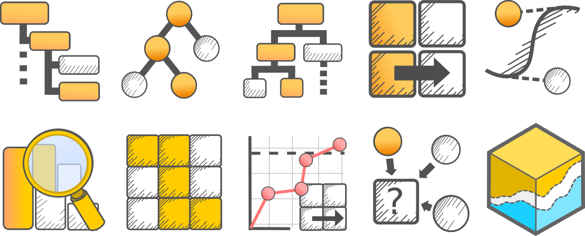

[Back to top](#Index)

## Marketing

You can see a better presentation of this project in my [Behance profile](https://www.behance.net/pedrocorre8962/).

Although not an area for which I have a lot of experience I did design and develop a number of graphical products marketing related.

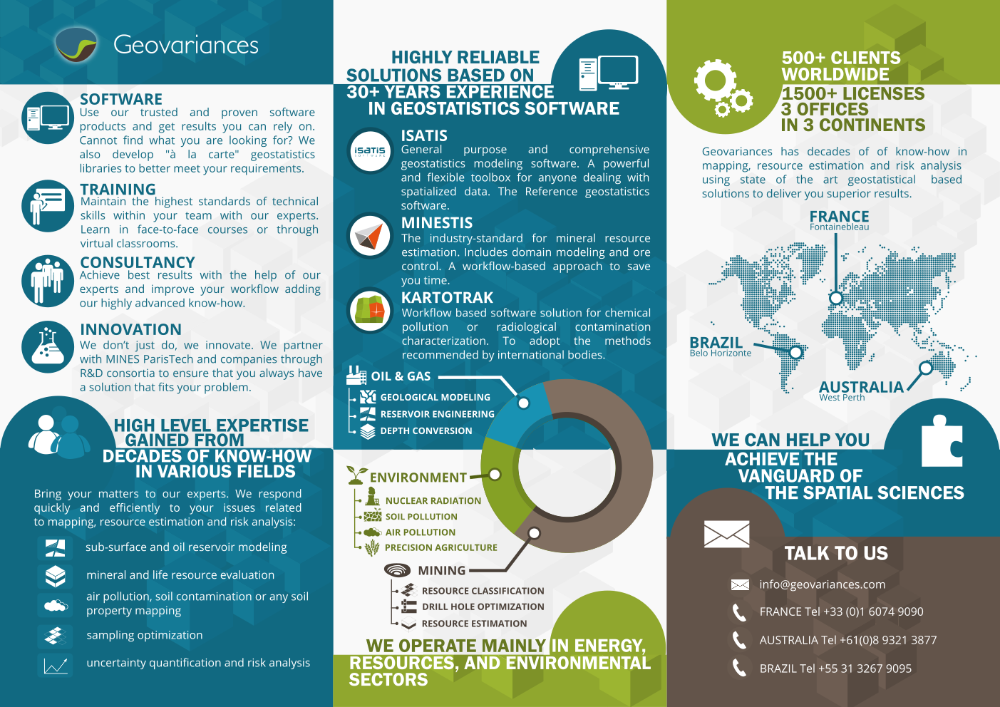

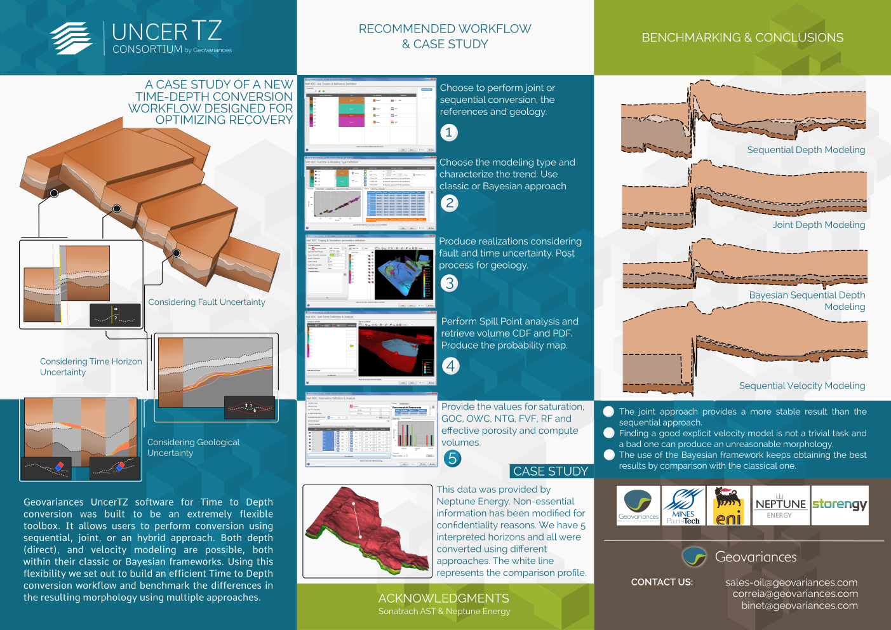

This flyer was developed as a two sided foldable, one side being of scientific nature (a poster in an international conference), the other corporate.

[Back to top](#Index)

## Scientific Illustration

You can see a better presentation of these projects in my [Behance profile](https://www.behance.net/pedrocorre8962/).

I've published a number of works in international conferences and a few educational projects.

The following is a static image of the poster [A Case Study Of A New Time-Depth Conversion Workflow Designed For Optimizing Recovery](http://www.earthdoc.org/publication/publicationdetails/?publication=93943) presented at ECMOR XVI - 16th European Conference on the Mathematics of Oil Recovery.

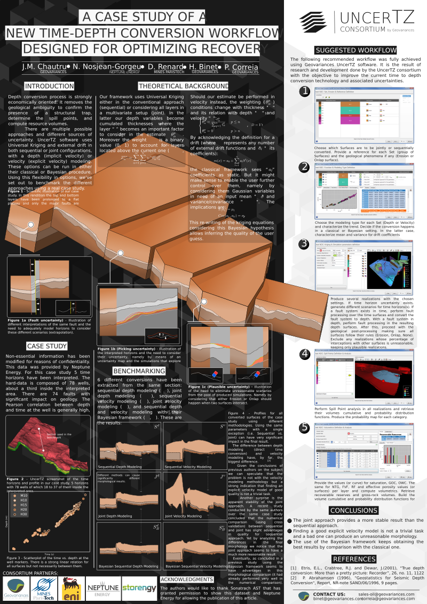

The following is a static image of the poster [Proper Systemic Knowledge of Reservoir Volume Uncertainties in Depth Conversion](http://www.cspg.org/cspg/documents/Conference%20Website/Gussow/Archives/2018/Extended/Poster/D.Garner.pdf) presented at Closing the Gap III - Advances in Applied Geomodeling for Hydrocarbon Reservoirs.

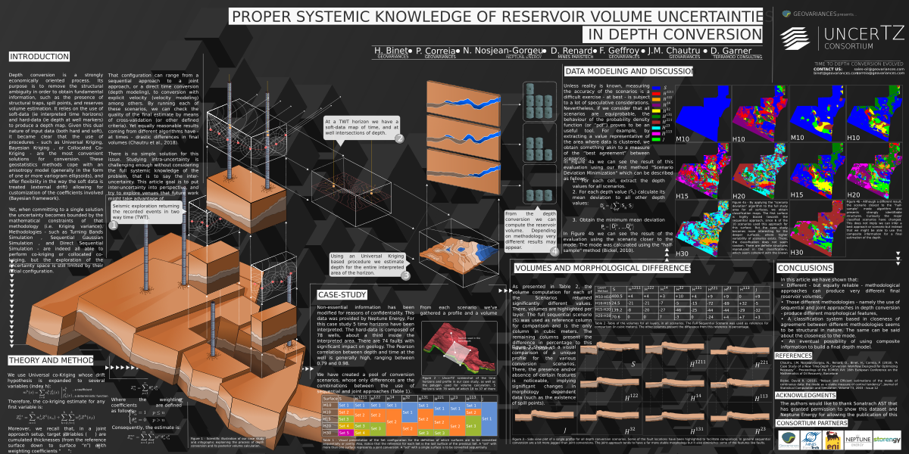

[Back to top](#Index)

## Game Art and Animation

These screenshots are from a demo presented to a book publisher in Lisbon that specialized manuals for the Portuguese language:

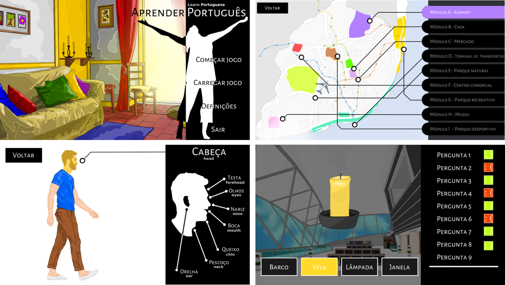

These screenshots are from a demo made to be presented to an university hospital in Lisbon:

This is a built set of screenshots from the proof of concept of a point and click game which had a lot of vectorial art with sprite and programatic animation.

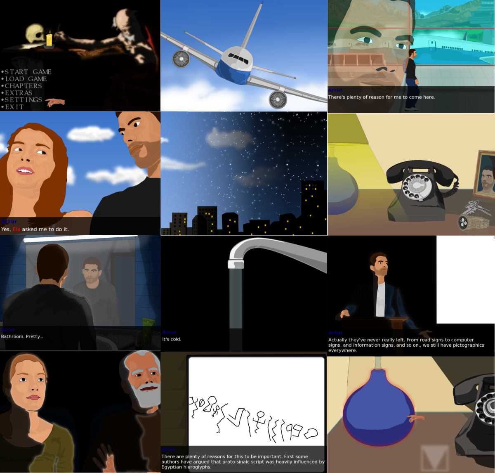

Finally here is an example of some of the art for the series of "Oscar" games (a cat) which includes one of the release titles and one that was being prepared when we finally decided to end anteia:

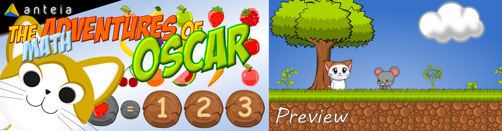

[Back to top](#Index)

# User Experience

I've made quite a few new widgets using UI library Qt. I've also designed experiences in small video games (using game engines) and workflows for scientific operations (desktop).

## Widgets

This section serves to provide examples of some widgets I made either in prototypes or for production. All of them were implemented in Qt (either directly in C++ or Python for the prototypes, eg PyQt or PySide).

This is an implementation I made in Qt for a switch button very tipical in mobile OS:

The project actually associated with another to create a kind of toggle button that accepts external widgets. This was created to great simplify the process of defining the inputs of an operation that relies heavily on multiple parameters. You'll notice that some other customized widgets made to further improve the experience.

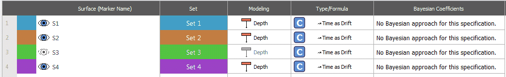

The following images are from a prototype to multi-select variables from a file (in our case a type of object that can have other types of objects with different categories):

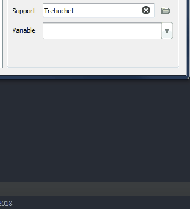

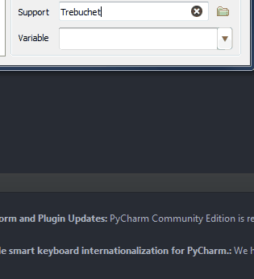

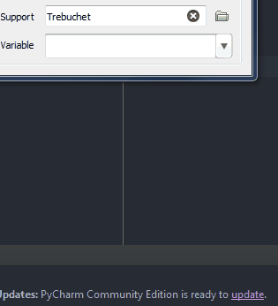

This final example is the prototype implementation of a Ribbon alike widget in the Qt framework:

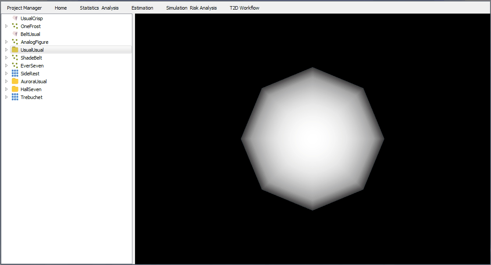

This project took some experimentation also to deal with re-sizing the ribbon: 

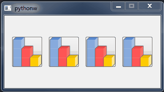

[Back to top](#Index)

# Video Production

I've recently produced the [promo video for Isatis.neo software](https://www.youtube.com/watch?v=ge-dMqsSFmo).

[Back to top](#Index)

# Musical composition and Songwriting

For a better presentation you can check all tracks in my [Soundcloud profile](https://soundcloud.com/pedro-correia-712367707).

* [A Procura (The Search)](https://soundcloud.com/pedro-correia-712367707/a-procura) - This was an early sketch of a music for a video game (a kind of point and click crime novel) that was never finished. This is the type of music made to be played in loop (thus the repetition). It was made to give a sense of investigation, mystery, a searching for answers.

* [WALF - Tema Principal (Main Theme)](https://soundcloud.com/pedro-correia-712367707/main-menu-theme) - This was an early sketch of a music for a video game (a kind of point and click crime novel) that was never finished. This particular track was made to be played in the main menu.

* [Sozinho na tua cor (Alone in your color)](https://soundcloud.com/pedro-correia-712367707/sozinho-na-tua-cor-myspace) - Songwriting in my university days, when social/ethical activism was a daily routine (released under the pseudonym Duarte Remna). It speaks about isolation, loneliness, indinference and prejudice.

* [Nova Terra (New Land)](https://soundcloud.com/pedro-correia-712367707/nova-terra-myspace) - Songwriting in my university days, when social/ethical activism was a daily routine  (released under the pseudonym Duarte Remna). It speaks about unfair treatment given to immigrants.

[Back to top](#Index)

